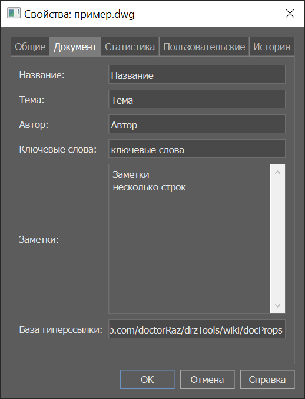
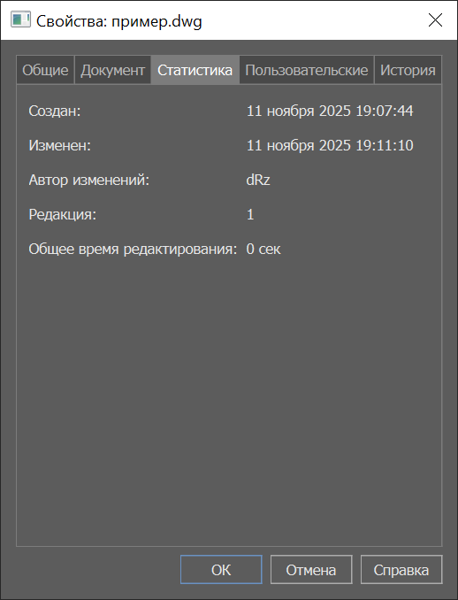
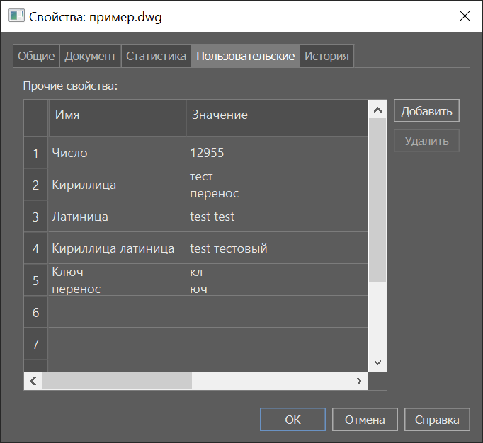

> [!Note]
> Импорт - экспорт свойств файла DWG

# Описание команд 

## Команды зарегистрированные в меню, панелях, ленте.

|Команда|Название|Описание|
|---|---|---|
|drz_docProps_import_tbl|Импорт свойств из таблицы|Импорт свойств из таблицы мультикад в текущий документ|
|drz_docProps_import|Импорт свойств из файла|Импорт свойств из стороннего файла в текущий документ|
|drz_docProps_export|Экспорт свойств в файл|Экспорт свойств документа в сторонний файл|
|drz_docProps_clear_standard|Удаление стандартных свойств|Удаление стандартных свойств из текущего документа|
|drz_docProps_clear_custom|Удаление пользовательских свойств|Удаление пользовательских свойств из текущего документа|
|drz_docProps_clear_all|Удаление всех свойств|Удаление всех свойств из текущего документа|
|drz_docProps_cmdInfo|Команды docProps|Информация о доступных командах с описаниями в ком строку|
|drz_docProps_home|О docProps|Домашняя страница программы|


# Свойства DWG

## Стандартные свойства документа

|Документ|Статистика|
|---|---|
| | | 
 
так это выглядит после экспорта в \*.ini

```ini
[StandardDocProperty]
Title = Название
Subject = Тема
RevisionNumber = 1
LastSavedBy = dRz
Keywords = ключевые слова
HyperlinkBase = https://github.com/doctorRaz/drzTools/wiki/docProps
Comments = Заметки\nнесколько строк
Author = Автор

[CustomDocProperties]

```

## Пользовательские (кастомные) свойства документа

|Пользовательские|
|---|
||


так это выглядит после экспорта в \*.ini

```ini
[StandardDocProperty]
Title = 
Subject = 
RevisionNumber = 
LastSavedBy = 
Keywords = 
HyperlinkBase = 
Comments = 
Author = 

[CustomDocProperties]
Число=12955
Кириллица=тест\nперенос
Латиница= test test
Кириллица латиница=test тестовый
Ключ\nперенос=кл\nюч
```

## Возможности

1.  
1.  

# Как пользоваться

## 1. Пакетный режим

При необходимости изменить в нескольких файлах чертежей свойства, можно воспользоваться штатной утилитой nanoCAD `BATCHPROCESS,ПАКЕТОБР` - *Пакетная обработка файлов...*
и лиспом в одну строку

Например надо в нескольких файлах изменить свойства Автор будем менять файл для импорта

``` ini
[StandardDocProperty]
Title = 
Subject = 
RevisionNumber = 
LastSavedBy = userName
Keywords = 
HyperlinkBase = 
Comments = 
Author = 

[CustomDocProperties]

```

```lisp
(defun c:iif ()
  ;;import INI
  (command "drz_docprops_import" "d:\\@Developers\\Programmers\\!NET\\!docProp\\test\\боевой.ini")
   (princ)
)
```


```lisp
(defun c:it ()
  ;;import McTable
  (command "drz_docprops_import_tbl" "реквизиты проекта")
  (princ)
)
```

## 2. Импорт из именованных таблиц nanoCAD

1.
1.

