# Добавление программ в автозагрузку CAD

Добавление в автозагрузку **drzTools** для nanoCAD

1. Распаковываем из архива папку *drzTools* в любой каталог, куда у пользователя есть доступ\
> [!Note]
> если  корпоративные политики запрещают скачивание архивов, скачайте архив  с суффиксом `*protected.7z`
> пароль на архив: название приложения `drzTools`

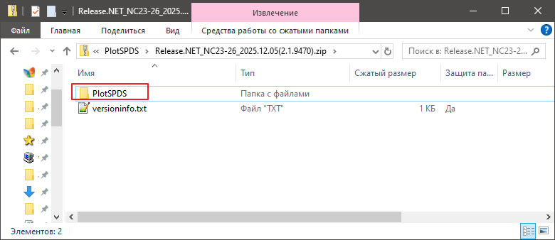

2. В CAD жмем\
`Сервис` -> `Приложения` -> `Загрузка приложения`

В классическом меню тут:

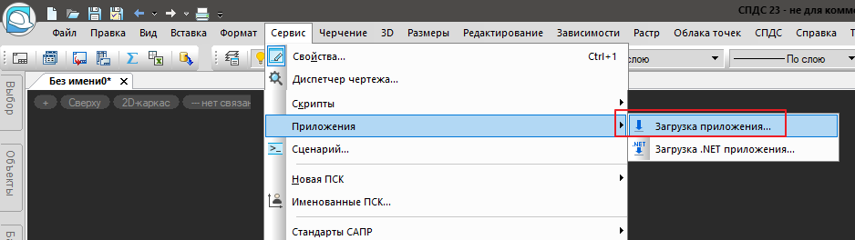

на ленте тут:

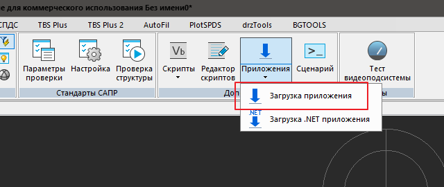

3. Откроется окно загрузки /выгрузки приложений

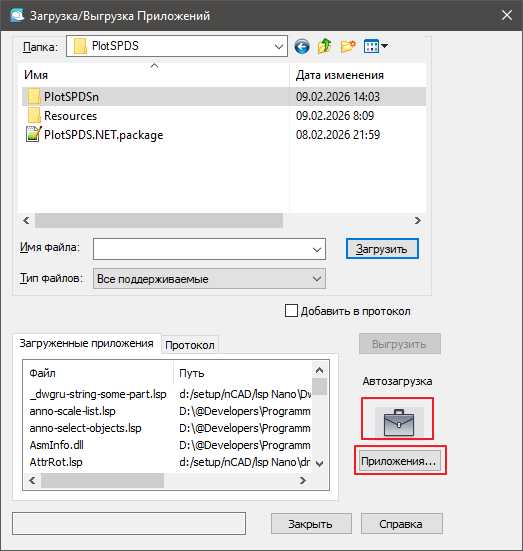

нажимаем на иконку чемоданчика или `Приложения...`

4.  Откроется окно автозагрузки

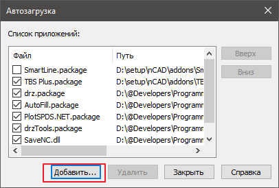

нажимаем кнопку `Добавить`

5. В открывшемся окне переходим в каталог куда мы распаковали папку `PlotSPDS` и выбираем файл `PlotSPDS.NET.package`

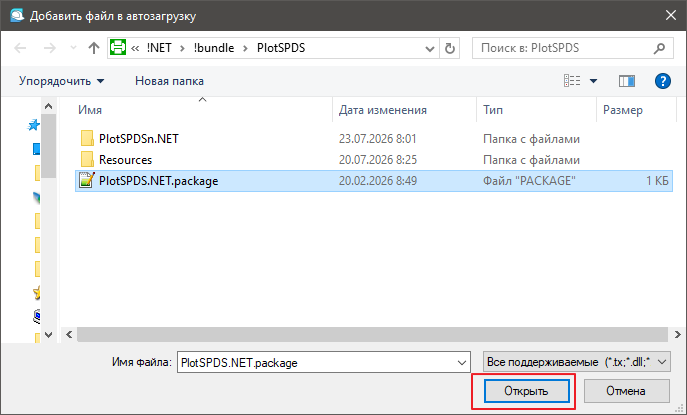

открываем файл

6. Закрываем окно автозагрузки кнопкой `Закрыть` (если закрыть крестиком ничего не добавится)

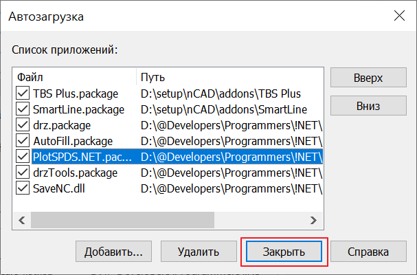

7. Закрываем окно `Загрузка/выгрузка приложений`

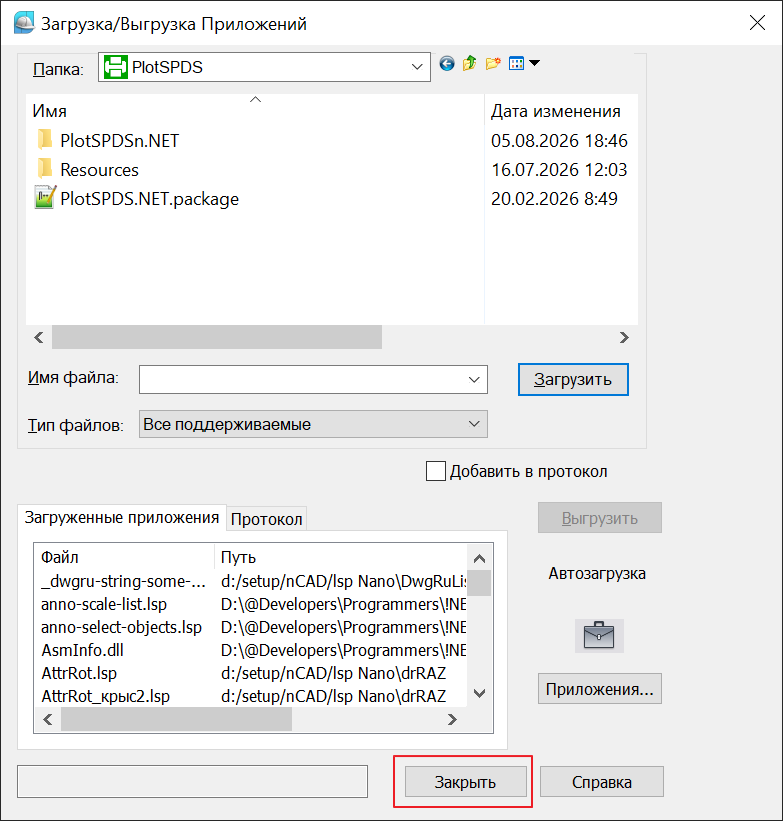

8. Перезагружаем CAD

На ленте появятся вкладки загруженного приложения.

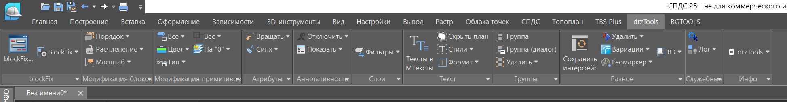

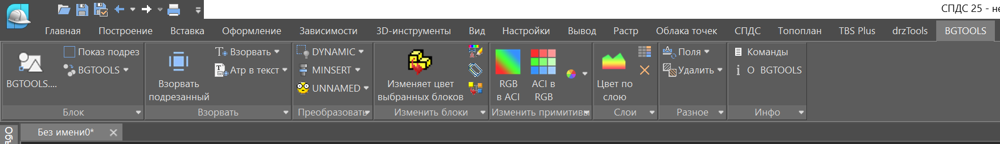

В классическом интерфейсе появятся новые пункты меню

|                     drzTools                      |                     BGTOOLS                      |
| :-----------------------------------------------: | :----------------------------------------------: |
| 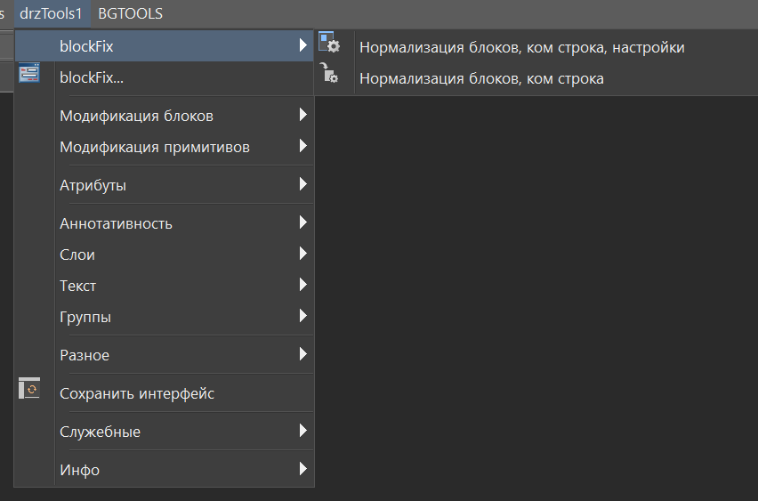 | 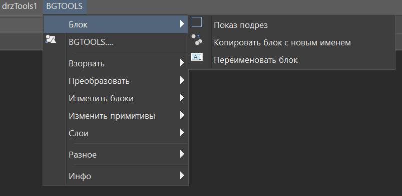 |

и панели инструментов

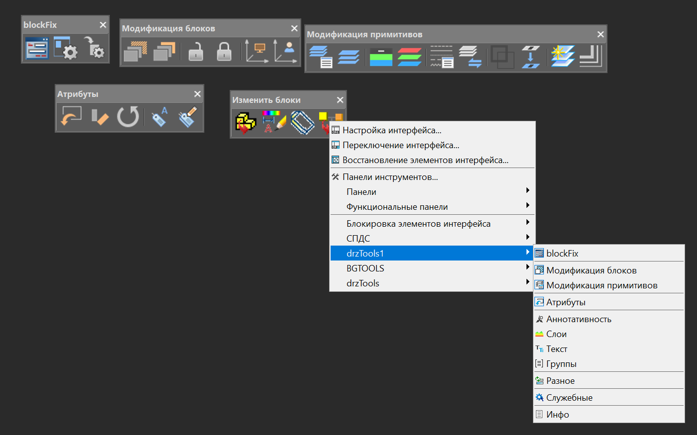

10. **Пользуемся.**
 
> [!Note]
> Таким образом можно загружать не только пакеты приложений \*.package, но и остальные программы загрузку которых поддерживает CAD: \*.dll,  \*.lsp, \*.nrx
> 
> 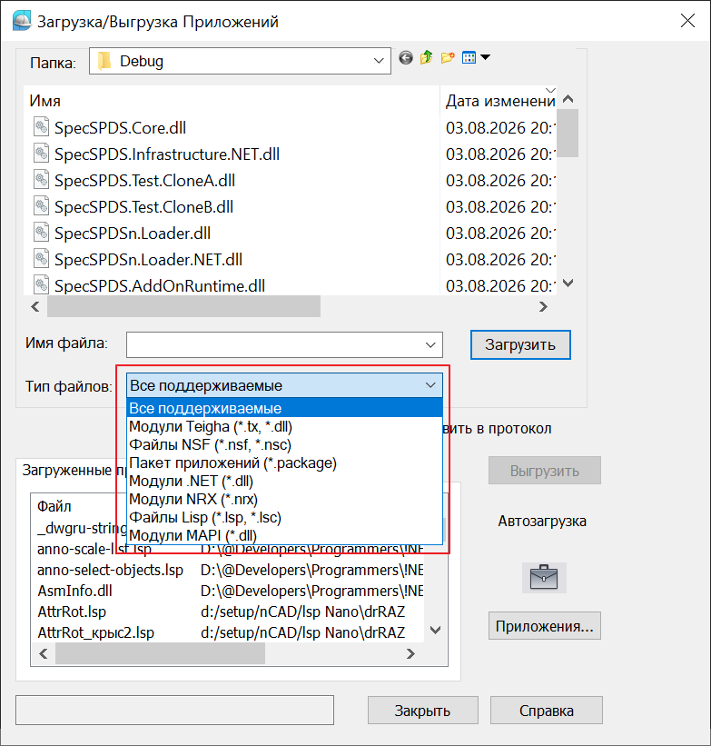

 